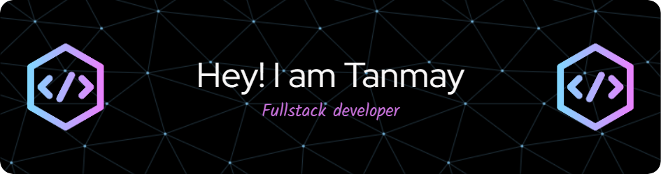

<h1 align="center">
    
</h1>

 

<!--   <h2>🐍 Contributions 🐍</h2>
  

 -->
<h2 align="center">Leetcode Info<h2>

  

  
  
  
  

  
    

<h3 align="center">A passionate frontend developer from India</h3>

  

- 🌱 I’m currently learning **Backend.**

- 👨‍💻 All of my projects are available at [https://github.com/tanmayraj2309](https://github.com/tanmayraj2309)

- 💬 Ask me about **react.**

- 📫 How to reach me **rtanmay52@gmail.com**

- 📄 Know about my experiences https://tinyurl.com/ctrltanmay

<h3 align="left">Connect with me:</h3>

<h3 align="left">Languages and Tools:</h3>

                

<!--   <h2>🐍 My Contributions 🐍</h2>
    -->
<!--    -->

  
     

&nbsp;

